<div align=center></div>

[简体中文](./README.md) | English

OncePower is a tool for batch renaming files or folders. It integrates installation free, foolproof, and quick to use, with clear functions and low learning costs.

This software supports English, in order to be lazy so use the Chinese interface of the demo gif.

## New features
Recording the last usage configuration (Off by default, you can go to Settings to open)

The retention mode can be named with a date, and the specified length can be truncated when naming the date.

Custom prefix and suffix start number

## Language Support

- 中文
- English

## Platform Support

- **Windows**
- **macOS** (Need to pack yourself)
- **Linux** (Pause packaging, pack or leave a message if needed)

## Quick Start

This tutorial will only cover some techniques.

To add a file or folder to rename, you can drag it directly onto the software (if you do not select **Add Folder(添加文件夹)**, dragging the folder will automatically retrieve all sub files), or you can click the button at the bottom.". Double click the file name to quickly add the file name to the input box.

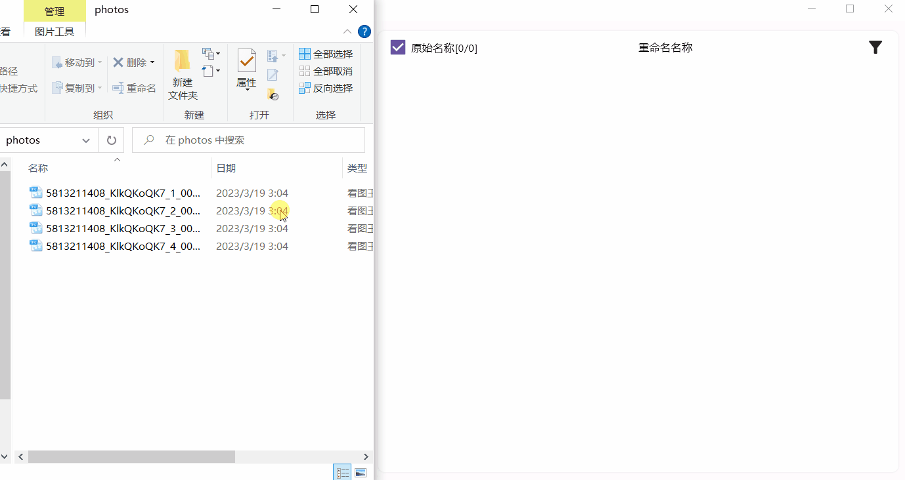

This software has three modes: Default Mode, Reserved Mode and Length Mode.

### Default Mode(默认模式)

In default mode, **Match Text(匹配内容)** will be deleted.

The content entered in the input box of **Update Text(修改为)** will replace the matching content.

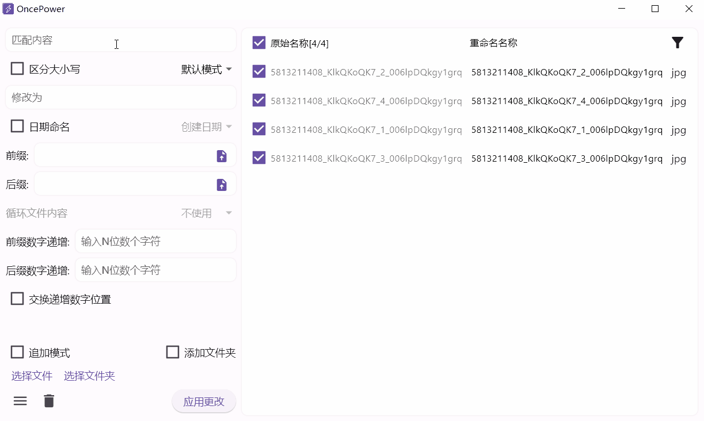

### Reserved Mode(保留模式)

The matching content in the retention mode will be retained, and other content will be deleted.

You can also select different types of reservations through options.


Selecting **Date Naming(日期命名)** will change the match to the date it was created. You can choose different date names. If **Exif Date** is selected (only images with exif information are available) and images are not, the earliest of several dates will be used.

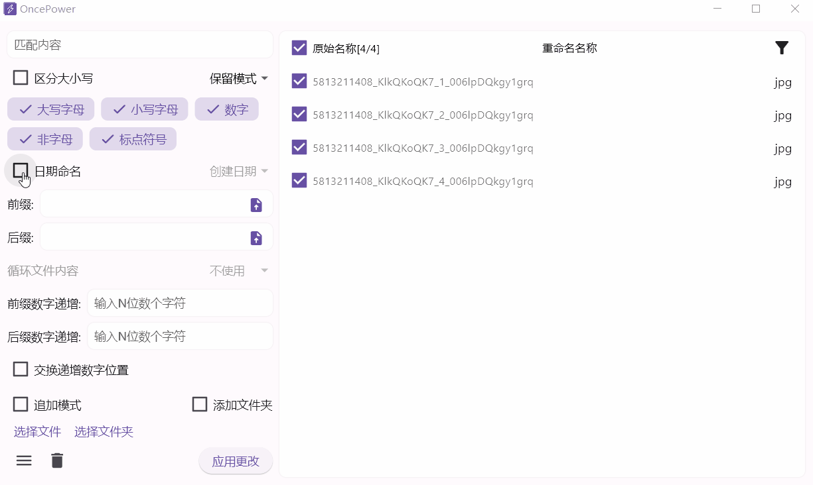

When naming with a date, you can choose to retain the number of date digits (default is year, month, day, hour, minute, second)


### Length Mode

In the Length Mode, you can randomly enter a string of length, or use **\*digits** to retain (if you choose to delete the specified length, it will be deleted) the same length as the random string or the first few digits of the specified number.

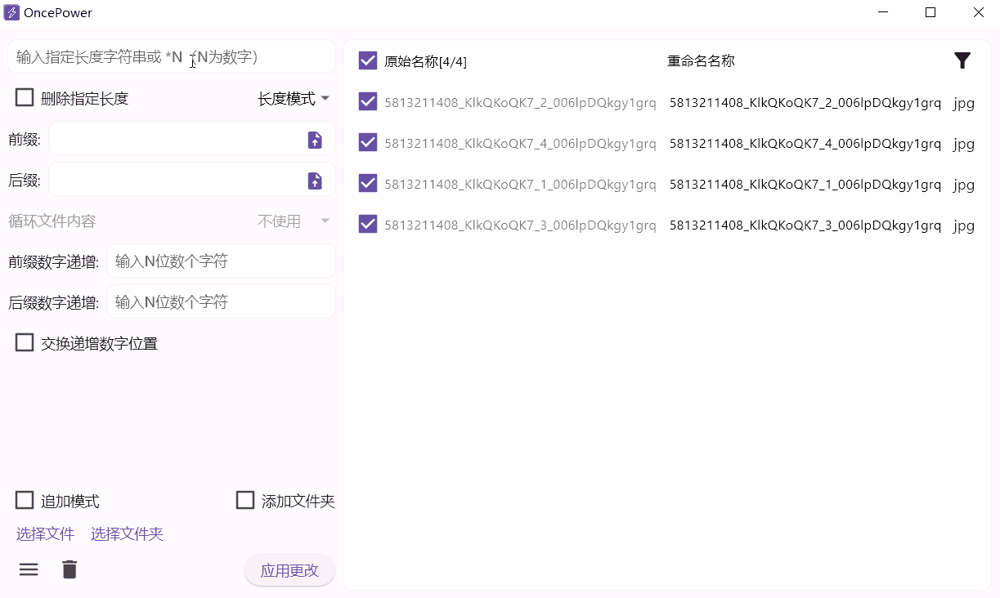

If you want to get the middle part of the content, you can type **_digits_** twice. For example, if you type '*8*12', it will cut the beginning of the 8th character to the beginning of the 12th character.


### Prefix and Suffix

The **Prefix** and **Suffix** can be entered directly, and the selected file will have its content added before or after the original name.

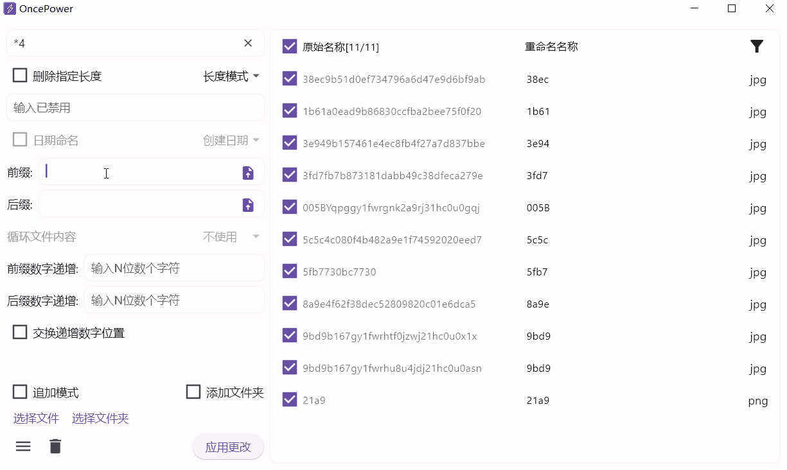

After the input boxes for **Prefix** and **Suffix**, there is an upload button that allows you to upload a **. txt ** file. The uploaded file content must be separated by **spaces** or **line breaks**. For example:

```txt
January 一月
February 二月
March
April

```

Note that there is a blank line at the end of the above, which will occupy a prefix or suffix position.

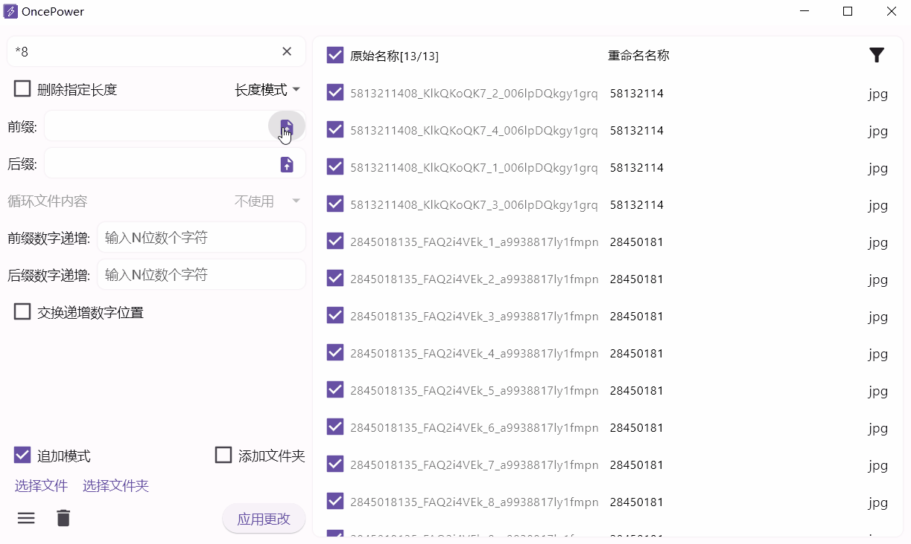

Under the **Suffix**, there is an option for **Loop File Content**, which can be used to control whether to use circular content as a prefix or suffix when the uploaded file content is less than the selected file to be renamed.

When we choose to upload prefix and suffix files, if we want to add a space or a dash between them, we can directly add it before and after the file name.

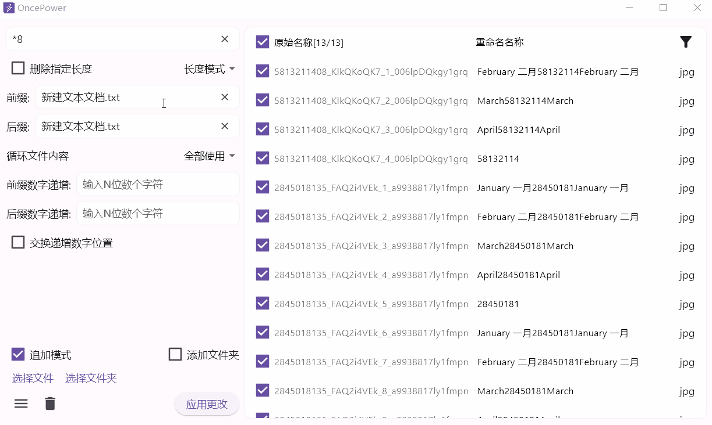

### Prefix and Suffix Index

Any content entered in the **Prefix Digit Increment(前缀数字递增)** and **Suffix Digit Increment(后缀数字递增)** will only have its length removed as the length of the incremented number. If you want to add spaces, you need to add them in the **prefix** and **suffix**.

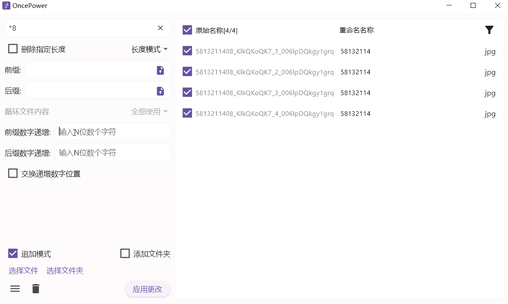

**Swap Incremental Digital Positions(交换递增数字位置)** You can place a prefix before the incremented number or a suffix after the incremented number.

### Custom prefix and suffix numbers

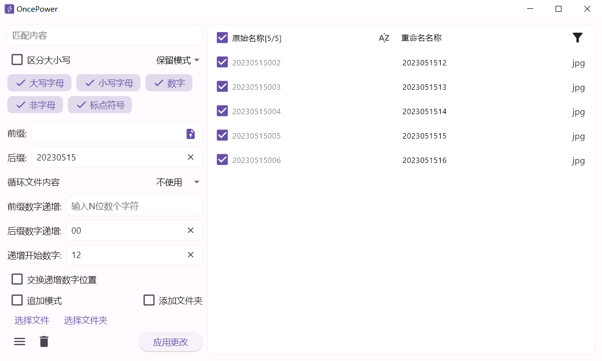

### Append Model

By default, adding a new file will replace the previously existing file. By selecting the **Append Mode**, you can directly add it later.

### Add Folders

**Add Folder** can be used to select a folder and change its name.

### Organize File

The **Organize File** function is located in the menu in the lower left corner.

It is mainly used to move files in nested folders. For example, I have a folder where the first and innermost layers each have a file with the same name.

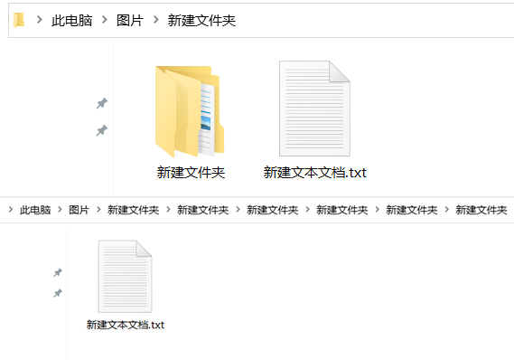

We can select the outermost parent folder and organize it:

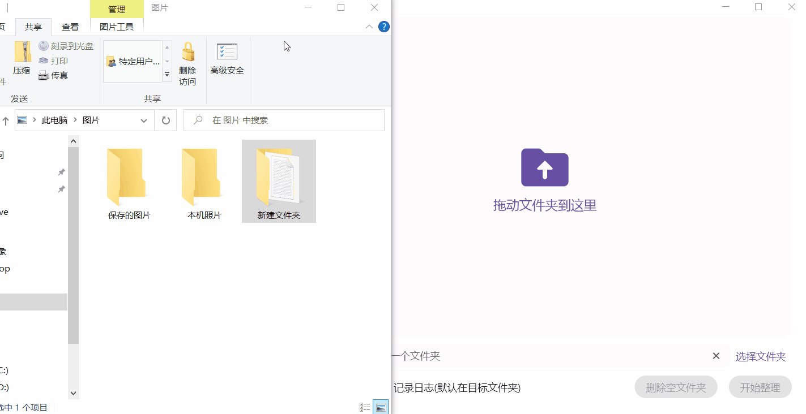

Click **Delete Empty Folder** to delete useless nested empty folders.

## Software Packaging

This project has only been tested in Win10 and Ubuntu. macOS needs to test itself, so it should not be necessary to configure a third-party library.

Because use the [flutter_distributor](https://distributor.leanflutter.org/zh/docs/getting-started), packaging configuration file has been configured. If you want to pack, execute the following commands:

```shell
dart pub global activate flutter_distributor
```

**Ubuntu**

```shell
flutter_distributor package --platform linux --targets deb
```

**macOS**

```shell
npm install -g appdmg
```

```shell
flutter_distributor package --platform macos --targets dmg
```

## LICENSE

[GPL 2.0 License](./LICENSE)
