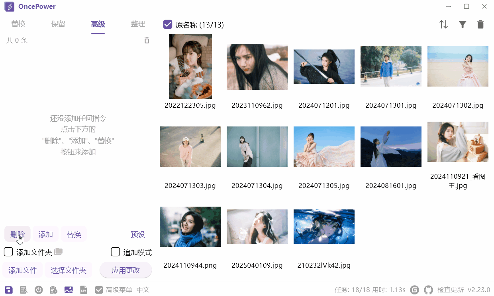
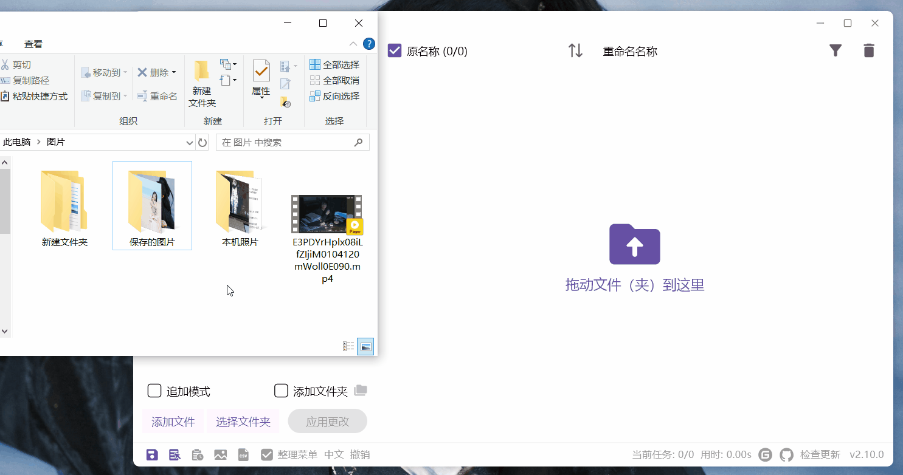
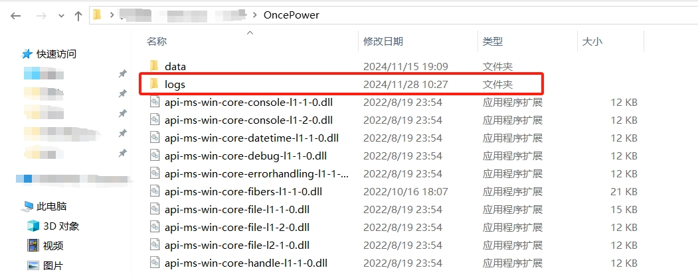
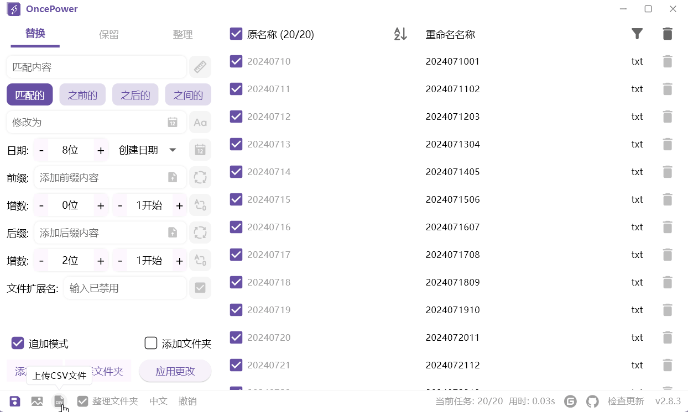
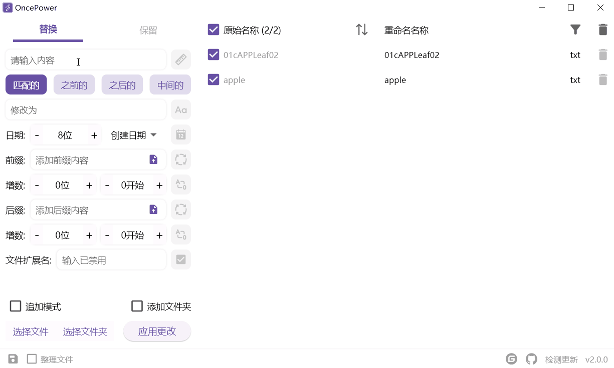
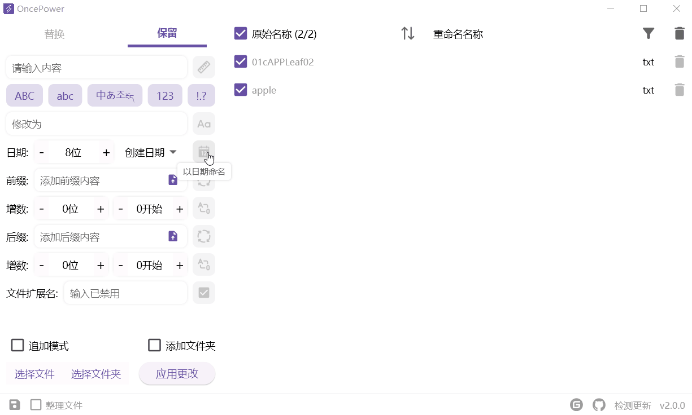
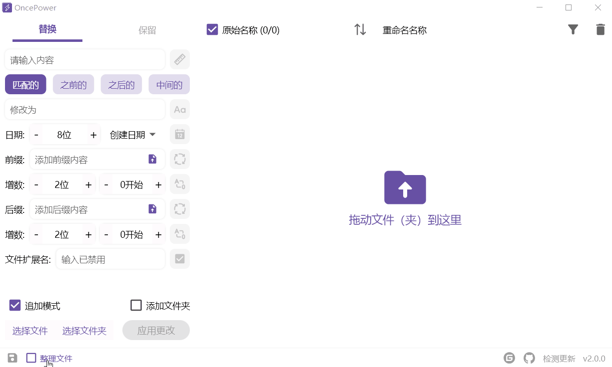

[简体中文](README.md) | English

OncePower is a file and folder batch renaming utility with additional features of batch deleting empty folders and batch moving files, allowing users to do advanced matching without learning regular expressions.

The original intention of software development was to batch rename images, so the new version has updated a new feature specifically for image renaming —— **View Mode**.

> [!Tip]
>
> Due to the difficulty of recording GIFs, only dynamic diagrams in Chinese are available. If you do not understand, you can open the software and refer to the pictures to learn and use them

# Language Support

- **中文**
- **English**

# Platform Support

- **Windows**(Support system versions of Win10 and above)

# New Feature

## Added the function of inserting content based on spaced repetition.

## Metadata adds shooting device information recording

## Automatically restore the previous window size and position

Long-press the "Save Configuration" icon for settings

## Export filename

## Add content to the extension name

## Custom background image

Long press the theme switch button

## Preset overlay with the same name

## Naming of media file metadata

## Batch operation instructions

Right click to open the menu by selecting multiple directives

## Modify file date

## Preset sorting

## Import presets

## Export presets

## Filter Unnamed Files

## Expand the display width of the new name

## Dark theme

## Customize image size

Long press the image size adjustment button to customize the image size

## Added the function of zooming in and out of images

Click the left mouse button to enlarge the image and right-click to shrink the image

## Added the function of temporarily storing files

## Simplification conversion

## Added PSD file preview

## Grouping Function

File settings group (only in AdvanceMode)

Instruction setting group

## Multiple Choice Function

You can sort files by numbering them with a single click using the Ctrl key

You can also use the Shift key to select multiple files and sort them by numbering them at once

## Advance Menu Function

Open and enter through the menu in the bottom left corner

In the advanced menu, use the command to rename

Adding different instructions and the order of instructions will cause different changes in the file name

We can store commonly used instructions as presets for future use

## View mode has added the function of previewing videos

## View mode adds the ability to move images to the beginning and end

## Organize mode can move the selected files directly to the respective top parent folder

## The target file input box in Collate mode can be switched by the up and down keys

## Add files through the Windows system right-click menu

Activate this function in the lower left corner

After opening it, we can right-click in the File Explorer to view the menu for directly adding files to the software when selecting or not selecting a folder.

Due to the limitation of the Windows system that only one file path can be passed in at a time, this feature can only select folders when the program is not running.

If you want to use multiple file or folder paths, you can place the shortcut of this software in the "Launch to" folder.

Then select the file that needs to be passed in and right-click

In the running state of the software, multiple files can be directly added using the right-click menu without the need to use "send to" to add multiple files (when running, adding by right clicking will automatically select the append mode).

## Match length with negative input

When the matching length is negative, start truncating from the end of the file name

## Filter files by extension

## Generate operation log files in OPLOG format

The log files generated by renaming are located in the "logs" folder of the software. The log files generated from the **Organize** menu are also located here by default, unless a target folder is set.

## Upload CSV file renaming

*Note: Currently unable to recognize Korean, Tibetan, or other text in CSV files (can recognize Japanese)*

Click the button in the lower right corner to upload a CSV file (only the first two columns of the CSV file will be read), or a TXT file with “,” separating the old and new names, or an OPLOG log file generated by OncePower (which can be used to revert back to the original name).

## Added undo function

## View Mode

In view mode, you can directly view images for sorting. To enable view mode, simply switch to the bottom left corner (Switching to View Mode will automatically delete files other than images).

In view mode, long press the image to drag and sort it.

Right click on the image to switch between selected and deleted states.

# Quick Start

For unfamiliar icon functions, a prompt can be displayed after hovering over the mouse for the first time. You can also view the following image introduction

# Function Introduction

Add files or folders to the software, and you can choose multiple options to drag them directly or select them through the menu in the bottom left corner.

Double clicking on an item in the list will automatically fill in the matching box with the original name of that item.

**Append Mode**: Off by default, each time a new file is added it will clear the existing files.It will not be cleared when it is turned on.

**Add Folder**: Enable this option to drag a folder directly into the list. By default, dragging in a folder will add all files under the folder to the list.

The storage icon in the lower left corner allows you to save some of the user's configurations to the point where you don't need to reset them each time you open it (the contents of the input box are not saved).

## Batch rename

### Replace

Replace is to replace the matching content.

#### Replacement is the replacement of a match.

#### Match length

Input a number is the matching length, input "**number + space + number**" to intercept the specified section

#### Named by Date

If Naming by Date is turned on, matches are modified to be dates. The default is to name in 8-digit format for the date of creation.

You can control the number of digits in the date by adding or subtracting digits, or by entering numbers directly.

#### Prefix and suffix

##### Direct input

##### Upload file

Upload a txt file with the names separated by spaces or line breaks. If the file is simple you can just type "**name + space + name**" which will have the same effect.

### Reserve

Keep is to delete content outside of the match.

It can also be retained through the following options:

Other function introduction reference **Replace**

## Organize files

The Organize Files feature needs to be turned on by clicking on the bottom left corner. Once enabled, you can batch move files and batch delete empty folders.

Some instructions for this function are given in the software.

## Store Configuration

Clicking on the Store icon in the lower left corner allows you to save the fill option settings for certain options of the menu so that you will not have to repeat the settings the next time you use them.

All content settings are only valid if the storage function is enabled.

# LICENSE

[GPL 2.0 License](./LICENSE)
