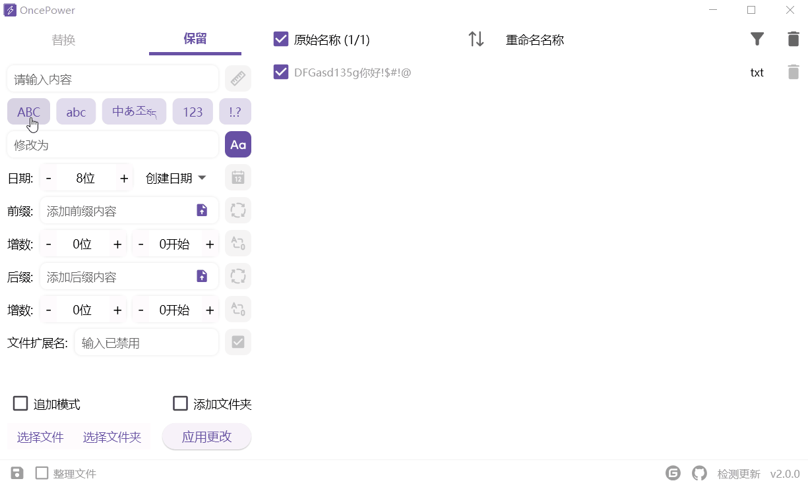

<div align="center"></div>

[简体中文](README.md) | English

OncePower is a file batch renaming tool that adds the ability to batch delete empty folders and move files.

The original intention of software development was to batch rename images, so the new version has updated a new feature specifically for image renaming —— **View Mode**.
> [!Tip]
>
> Due to the difficulty of recording GIFs, only dynamic diagrams in Chinese are available. If you do not understand, you can open the software and refer to the pictures to learn and use them

# Language Support
- **中文**
- **English**

# Platform Support

- **Windows**(Support system versions of Win10 and above)
- **macOS**(You need to pack it yourself. For details, please refer to **Packaging**)
- **Linux**(You need to pack it yourself. For details, please refer to **Packaging**)

# New Feature

## Upload CSV file renaming

Click the button in the bottom right corner to upload a CSV file, only the values in the first two columns of the CSV file will be read


## Added undo function

## View Mode

In view mode, you can directly view images for sorting. To enable view mode, simply switch to the bottom left corner (Switching to View Mode will automatically delete files other than images).


In view mode, long press the image to drag and sort it.


Right click on the image to switch between selected and deleted states.


# Quick Start

For unfamiliar icon functions, a prompt can be displayed after hovering over the mouse for the first time. You can also view the following image introduction


# Function Introduction

Add files or folders to the software, and you can choose multiple options to drag them directly or select them through the menu in the bottom left corner.

Double clicking on an item in the list will automatically fill in the matching box with the original name of that item.


**Append Mode**: Off by default, each time a new file is added it will clear the existing files.It will not be cleared when it is turned on.

**Add Folder**: Enable this option to drag a folder directly into the list. By default, dragging in a folder will add all files under the folder to the list.

The storage icon in the lower left corner allows you to save some of the user's configurations to the point where you don't need to reset them each time you open it (the contents of the input box are not saved).

## Batch rename

### Replace

Replace is to replace the matching content.


#### Replacement is the replacement of a match.


#### Match length

Input a number is the matching length, input "**number + space + number**" to intercept the specified section


#### Named by Date

If Naming by Date is turned on, matches are modified to be dates. The default is to name in 8-digit format for the date of creation.

You can control the number of digits in the date by adding or subtracting digits, or by entering numbers directly.


#### Prefix and suffix

##### Direct input


##### Upload file

Upload a txt file with the names separated by spaces or line breaks. If the file is simple you can just type "**name + space + name**" which will have the same effect.


### Reserve

Keep is to delete content outside of the match.


It can also be retained through the following options:



Other function introduction reference **Replace**

## Organize files

The Organize Files feature needs to be turned on by clicking on the bottom left corner. Once enabled, you can batch move files and batch delete empty folders.

Some instructions for this function are given in the software.


## Store Configuration

Clicking on the Store icon in the lower left corner allows you to save the fill option settings for certain options of the menu so that you will not have to repeat the settings the next time you use them.

All content settings are only valid if the storage function is enabled.

# Packaging

This project has only been tested on Win10 and Win11, macOS and Ubuntu will need to be tested on their own and should not require any special configuration of a third party library.

Since we use [flutter_distributor](https://distributor.leanflutter.dev/getting-started/), the configuration file for packaging is already configured. If you want to package it, you have to execute the following commands in order:

**Global installation of flutter_distributor**

```shell
dart pub global activate flutter_distributor
```

**Ubuntu**

```shell
flutter_distributor package --platform linux --targets deb
```

**macOS**

```shell
npm install -g appdmg
```

```shell
flutter_distributor package --platform macos --targets dmg
```

# LICENSE

[GPL 2.0 License](./LICENSE)


