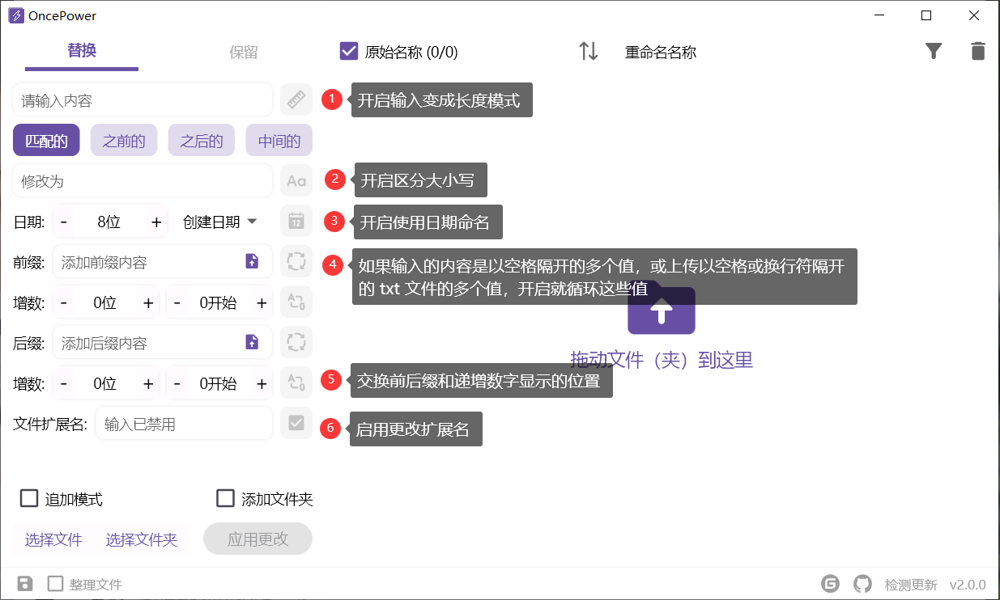
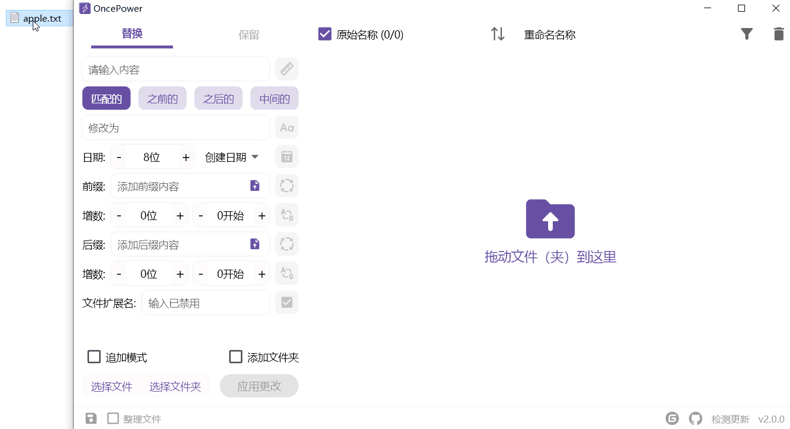
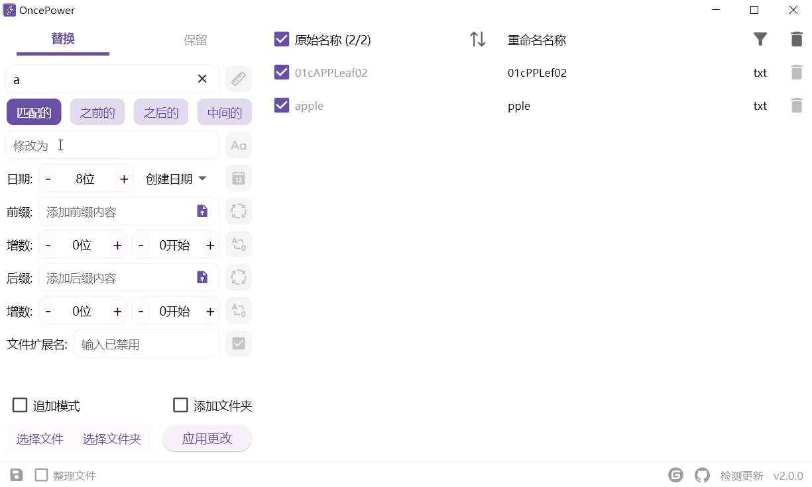
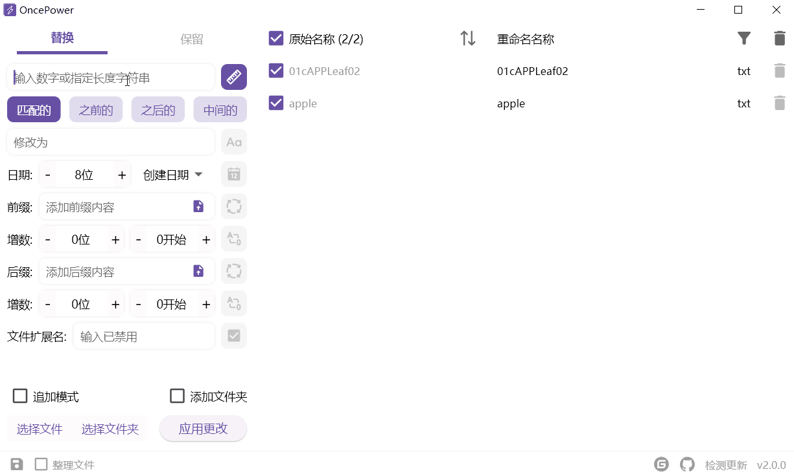
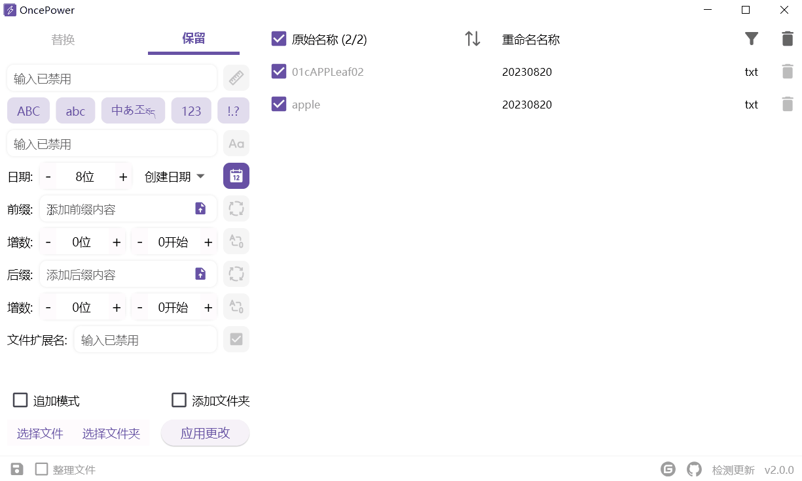
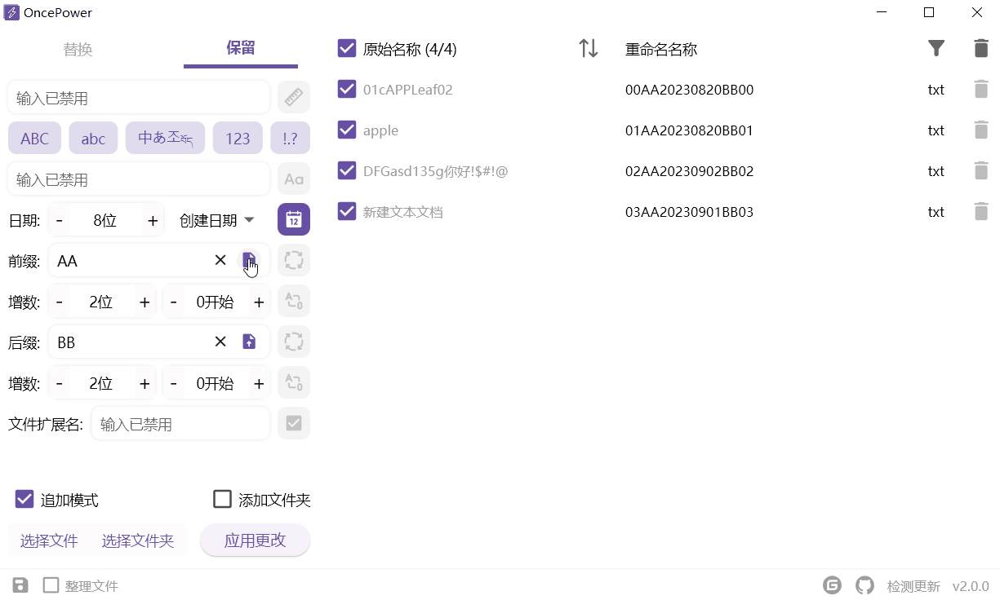
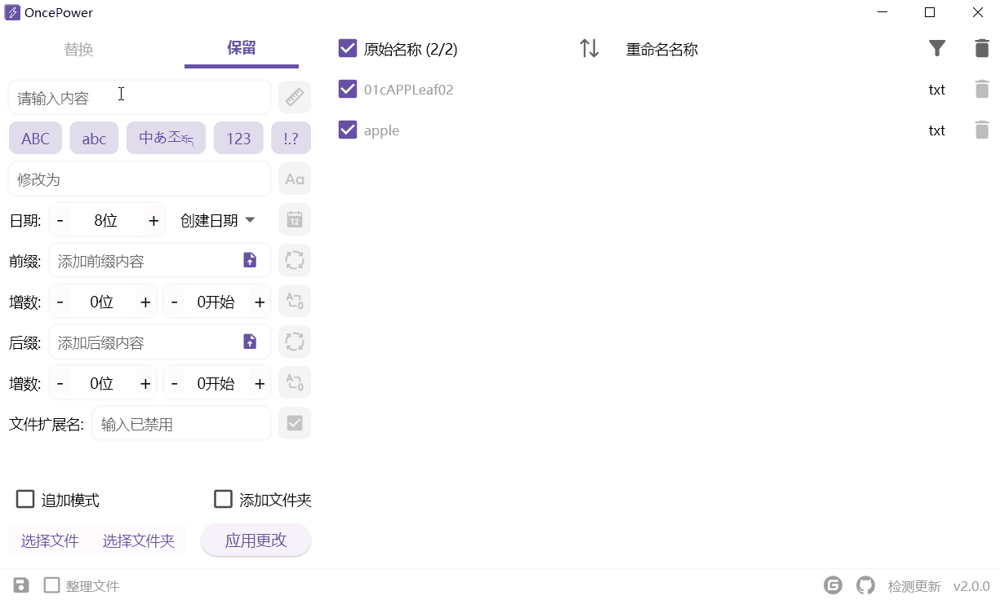

<div align=center></div>

OncePower 是一个文件管理工具，目前只有三个功能：批量重命名文件和文件夹（可对文件的扩展名进行批量修改）、批量移动文件和批量删除空文件夹。

该软件使用 Flutter 开发，可以很方便的跨多个平台。目前 2.0 版本，从 Provider 迁移到 Riverpod，对整体进行了重构，并重新设计了 UI，新版的 UI 更简洁。

# 平台支持

- **Windows**
- **macOS**（需要自己打包，详情可查看目录中 **打包** ）
- **Linux**

# 快速上手

初次使用对于不了解的图标功能，可以在鼠标停留后显示提示。也可以查看以下图片介绍



# 功能介绍

添加文件或文件夹到软件，可以选择多个直接拖入，也可以通过左下角的菜单进行选择。

双击列表中的某一项 ，将会把那一项的原始名称自动填入匹配框中。



**追加模式**：默认关闭，每次添加新的文件将会清空已存在的文件。开启后不会清除。

**添加文件夹**：开启该选项可以直接将文件夹拖入列表中。默认拖入文件夹会将文件夹下的所有文件加入列表。

左下角的存储图标，可以将用户的某些配置保存下来，以至于每次打开都不需要重新设置（输入框的内容不会保存）。

## 批量重命名

### 替换

替换就是将匹配的内容替换掉。


#### 修改匹配内容



#### 匹配长度

输入一个数字就是匹配长度，输入“**数字+空格+数字**”截取指定部分



#### 以日期命名

如果开启以日期命名，匹配的内容就会修改为日期。默认是以创建日期 8 位数的格式命名。

你可以通过加减来控制日期的位数，也可以直接输入数字。


#### 前缀后缀

##### 直接输入



##### 上传文件

上传一个以空格或换行符隔开各个名称的 txt 文件。如果文件简单可以直接输入“**名称+空格+名称**”将会是同样的效果。



### 保留

保留就是将匹配以外的内容删除。



也可以通过下面的选项进行保留：


其他功能介绍参考**替换**

### 整理文件

整理文件功能需要点击左下角开启。关于该功能的说明文件内有。


# 打包

该项目只在 Win10 和 Ubuntu 测试过，macOS 需要自行测试，不出意外应该不用特别配置某个第三方库。

因为使用了 [flutter_distributor](https://distributor.leanflutter.org/zh/docs/getting-started)，打包的配置文件已经配置好了。想打包的要依次执行一下命令：

**全局安装 flutter_distributor**

```shell
dart pub global activate flutter_distributor
```

**Ubuntu**

```shell
flutter_distributor package --platform linux --targets deb
```

**macOS**

```shell
npm install -g appdmg
```

```shell
flutter_distributor package --platform macos --targets dmg
```

# LICENSE

[GPL 2.0 License](./LICENSE)


