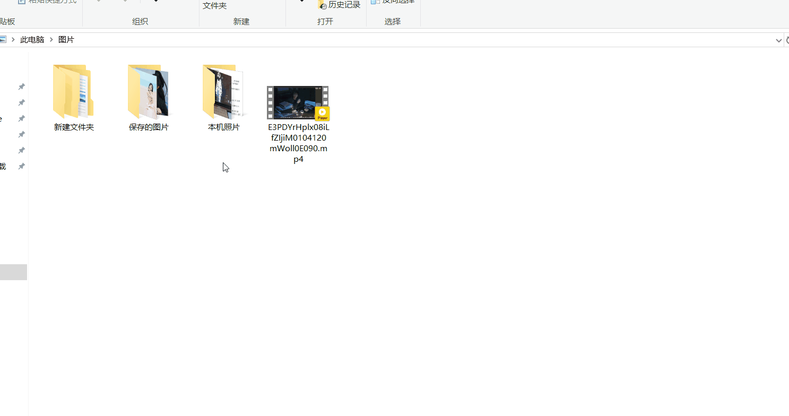

<div align="center"></div>

简体中文 | [English](README-EN.md)

OncePower 是一个文件和文件夹批量重命名工具，额外添加了批量删除空文件夹和批量移动文件的功能，用户无需学正则表达式既可进行高级匹配。

软件开发的初衷是想要对图片进行批量重命名，因此新版更新了特别针对图片重命名的新功能——**视图模式**。

# 语言支持
- **中文**
- **English**

# 平台支持

- **Windows** （支持win10及其以上的系统版本）
- **macOS**（需要自己打包，详情可查看 **打包** ）
- **Linux**（需要自己打包，详情可查看 **打包** ）

# 新功能

## 通过系统右键菜单添加文件

在左下角启动该功能


开启之后我们就能在文件资源管理器中选择或未选择文件夹时的右键查看到直接添加文件到软件的菜单。

因为 Windows 系统的限制一次只能传入一个文件路径，该功能在未运行程序时只能选择文件夹。


如要使用传入多个文件或文件夹路径，可以将本软件的快捷方式放置在“发动到”文件夹下。


然后选中需要传入的文件点击右键



在软件运行状态下可以直接使用右键的菜单添加多个文件，而无需通过“发送到”来添加多个文件（运行时通过右键添加会自动选择追加模式）


## 匹配长度输入负数

当匹配的长度为负数时，从文件名后面开始截取


## 根据扩展名过滤文件


## 生成 OPLOG 格式的操作日志文件

生成的日志文件在 C 盘用户下的 文档（Documents）文件夹下。


## 上传 CSV 文件重命名

*注：暂时无法识别 CSV 文件中的韩语、藏语或其他文字（可以识别日语）。*

点击右下角按钮即可上传 CSV 文件（只会读取 CSV 文件前两列的值），或者使用 "," 分隔新旧名称的 TXT 文件，或者 OncePower 生成的 OPLOG 日志文件（可以用来恢复为原名称）。


## 添加了撤销功能

## 视图模式

在视图模式下可以直接查看图片来进行排序，开启视图模式只要在左下角进行切换既可（切换到视图模式会自动删除图片以外的文件）。


在视图模式下，长按图片可进行拖动排序。


右键图片可以对图片进行选中状态切换，也可以删除图片


# 快速上手

初次使用对于不了解的图标功能，可以在鼠标停留后显示提示。也可以查看以下图片介绍


# 功能介绍

添加文件或文件夹到软件，可以选择多个直接拖入，也可以通过左下角的菜单进行选择。

双击列表中的某一项 ，将会把那一项的原始名称自动填入匹配框中。


**追加模式**：默认关闭，每次添加新的文件将会清空已存在的文件。开启后不会清除。

**添加文件夹**：开启该选项可以直接将文件夹拖入列表中。默认拖入文件夹会将文件夹下的所有文件加入列表。

左下角的存储图标，可以将用户的某些配置保存下来，以至于每次打开都不需要重新设置（输入框的内容不会保存）。

## 批量重命名

### 替换

替换就是将匹配的内容替换掉。


#### 修改匹配内容


#### 匹配长度

输入一个数字就是匹配长度，输入“**数字+空格+数字**”截取指定部分


#### 以日期命名

如果开启以日期命名，匹配的内容就会修改为日期。默认是以创建日期 8 位数的格式命名。

你可以通过加减来控制日期的位数，也可以直接输入数字。


#### 前缀后缀

##### 直接输入


##### 上传文件

上传一个以空格或换行符隔开各个名称的 txt 文件。如果文件简单可以直接输入“**名称+空格+名称**”将会是同样的效果。


### 保留

保留就是将匹配以外的内容删除。


也可以通过下面的选项进行保留：


其他功能介绍参考**替换**

## 整理文件

整理文件功能需要点击左下角开启。开启后可以批量移动文件和批量删除空文件夹。

关于该功能的一些说明详见软件内。


## 存储配置

点击左下角的存储图标可以对菜单某些选项的填写选项设置进行保存，以便下次使用时不再进行重复设置。

所有内容设置只在开启存储功能后更改的才有效。

# 打包

该项目使用 flutter 开发，只在 Win10 和 win11 测试过，macOS 和 Ubuntu 需要自行测试，不出意外应该不用特别配置某个第三方库。

因为使用了 [flutter_distributor](https://distributor.leanflutter.dev/zh-hans/getting-started/)，打包的配置文件已经配置好了。想打包的要依次执行一下命令：

**全局安装 flutter_distributor**

```shell
dart pub global activate flutter_distributor
```

**Ubuntu**

```shell
flutter_distributor package --platform linux --targets deb
```

**macOS**

```shell
npm install -g appdmg
```

```shell
flutter_distributor package --platform macos --targets dmg
```

# LICENSE

[GPL 2.0 License](./LICENSE)


